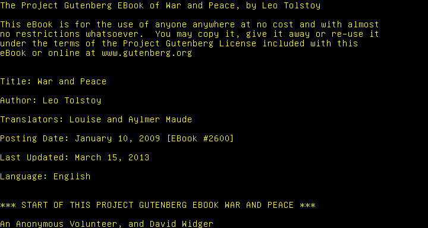
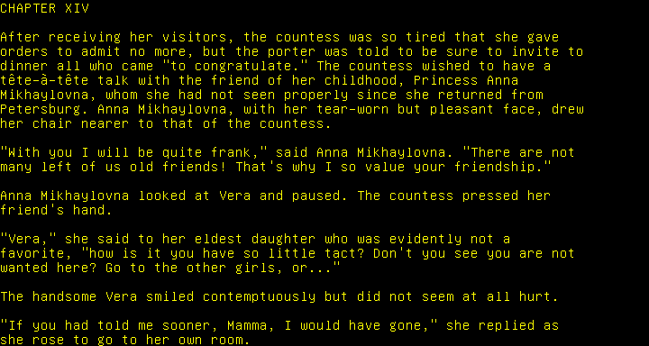

Texture-free opengl font render!

1. Use opengl `uvec` (16 bytes) to represent 8x16 psf-format Font.
2. Use numba to get unicode glyph from 791 codepoints to 512 glyph dictionary, and splitting by newlines
3. copy glyph ids into opengl shader
4. shader generates geometry (two triangles), fragment shaders asks for bitmasks
5. raw frame consumes by encoder

Just 3 seconds with python (and numba) to convert 3.2MiB War and Peace text into h264 encoded frame-accurate video (190MiB compressed, 2.2GiB uncompressed) 80x24 terminal-like video.

Only 0.53 for rendering it in-memory (gpu).


```
3.18 took. 2709 pages with 1191.07 average chars by page and 49.63 by line
```



First page with non-asscii `ê U+00EA LATIN SMALL LETTER E WITH CIRCUMFLEX`


